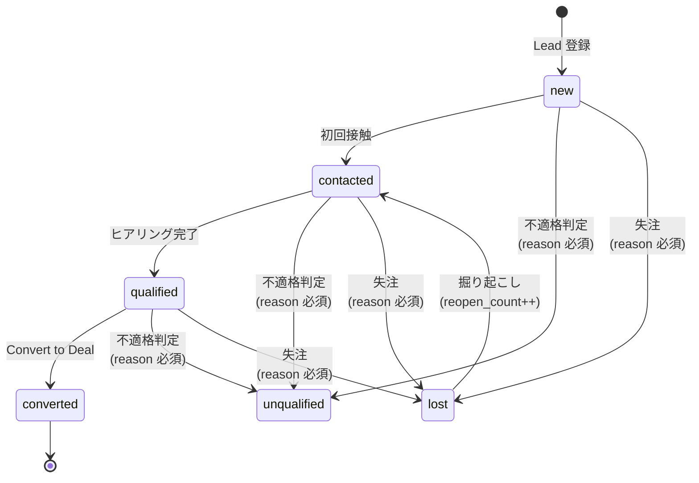

# SPEC: CRM Lead / Deal v2

**対象機能**: CRM の Lead・Deal・企業/クライアント・Pipeline 双方向同期
**作成日**: 2026-04-22
**ステータス**: ドラフト（議論確定後、実装着手）

---

## 1. 目的・スコープ・決定事項サマリ

### 1.1 背景
既存 CRM には Lead・Deal の基本 CRUD と Pipeline→Lead 片方向同期が実装済みだが、営業マネージャーが Forecast・コーチング・契約管理を行う観点で以下の欠落がある:

- 案件金額（`crm_deals.amount`）に **TCV / ACV / MRR / 契約期間** の区別がなく、スポット案件と顧問契約が同一列で混在している
- Lead から Deal への昇格基準が `status='qualified'` のみで、BANT 等の実質的な判定条件が不在
- 失注 Lead・案件の掘り起こし履歴、次回アクション、直近接触日が未管理
- `clients` と `crm_companies` が別テーブルで、ユーザー視点では同一であるべき企業情報が二箇所に分散
- Pipeline と CRM Deal の双方向同期が未実装（現状は Pipeline → Lead の片方向のみ）

### 1.2 目的
営業マネージャーが単一の CRM ビューで **Forecast（TCV/ACV/月次）・昇格判断・失注分析・次アクション追跡** を遂行できる状態にする。Pipeline と CRM Deal は併存させつつ、同一オポチュニティの 2 ビューとして完全同期する。

### 1.3 決定事項サマリ（議論確定済み）

| # | 論点 | 決定 |
|---|------|------|
| 1 | 金額モデル | `one_time_amount` + `monthly_recurring_amount` + `contract_term_months` の 3 入力から、TCV / ACV を双方向自動計算。3 変数のうち 2 つを埋めると残り 1 つを自動算出 |
| 2 | 失注理由 | 既存 `loss_reason` (TEXT 自由記述) を維持。enum 化は行わない |
| 3 | 昇格ゲート | **SOFT gate**: 警告表示のみ、押下はいつでも可能。マネージャー判断を尊重 |
| 4 | Lead / Deal 起票経路 | 新規顧客・既存顧客ともに、Lead 経由と直接 Deal 起票の両方を許容 |
| 5 | Pipeline と CRM Deal | 両方を保持し、完全双方向同期。Pipeline は月次 Forecast 視点、Deal は案件詳細視点 |

### 1.4 スコープ
**In scope**: データモデル拡張、UI コンポーネント (金額入力・昇格チェックリスト・Forecast 表示)、Pipeline ↔ Deal 同期、clients ↔ crm_companies name 同期トリガー。

**Out of scope（別仕様）**: マネージャー向けダッシュボード新設、失注 free-text の機械学習分析、clients テーブル完全廃止（Phase 3 として後続プロジェクトで実施）。

---

## 2. データモデル変更

### 2.1 新規カラム — crm_deals / crm_leads 両方に追加

| カラム名 | 型 | NULL許可 | デフォルト | 説明 |
|---|---|---|---|---|
| `deal_type` | TEXT (enum: 'spot' / 'retainer' / 'hybrid') | NO | `'spot'` | 案件種別。単発/顧問/ハイブリッド |
| `one_time_amount` | NUMERIC | YES | `0` | 初期一時費用（スポット部分） |
| `monthly_recurring_amount` | NUMERIC | YES | `0` | 月次顧問料（MRR） |
| `contract_term_months` | INTEGER | YES | NULL | 契約期間（月数） |
| `contract_start_date` | DATE | YES | NULL | 契約開始日 |
| `tcv` | NUMERIC | YES | `0` | 総契約金額（アプリ層で算出して保存、双方向編集のため generated column ではない） |
| `acv` | NUMERIC | YES | `0` | 年間契約金額（アプリ層で算出して保存） |
| `next_action` | TEXT | YES | NULL | 次回アクション内容 |
| `next_action_date` | DATE | YES | NULL | 次回アクション予定日 |
| `last_contact_date` | DATE | YES | NULL | 最終接触日（activities から自動更新） |
| `decision_maker_role` | TEXT | YES | NULL | 決裁者役職（社長/役員/部長/現場、自由記述） |
| `pain_point` | TEXT | YES | NULL | 顧客課題 |
| `competitor` | TEXT | YES | NULL | 競合他社 |
| `forecast_category` | TEXT (enum: 'commit' / 'best_case' / 'pipeline' / 'omitted') | NO | `'pipeline'` | 予測区分 |
| `stage_changed_at` | TIMESTAMPTZ | YES | `now()` | ステージ最終変更日時（トリガーで自動更新） |
| `reopen_count` | INTEGER | NO | `0` | 失注→再オープン回数 |

**crm_leads 追加分:**

| カラム名 | 型 | NULL許可 | デフォルト | 説明 |
|---|---|---|---|---|
| `budget_range` | TEXT (enum: '<100万' / '100-500万' / '500万-1000万' / '1000万+' / '未確認') | NO | `'未確認'` | 予算帯 |
| `expected_start_period` | TEXT (enum: '1M以内' / '3M以内' / '6M以内' / '未定') | NO | `'未定'` | 開始希望時期 |
| `qualification_score` | INTEGER | NO | `0` | BANT スコア（0–6、自動算出） |

※`loss_reason` は既存 TEXT 列を変更せず継続利用（ユーザー判断）。

### 2.2 既存 amount カラムの扱い

`crm_deals.amount` は後方互換のため残置する。保存時にアプリ層で `tcv` の値を `amount` にも書き込むことで、既存の集計・レポート・外部参照が引き続き機能する状態を維持する。スキーマ上は `-- DEPRECATED: use tcv` コメントを付与し、将来のマイグレーション（062 以降を想定）で削除予定。新規コードからの参照は禁止とし、全て `tcv` を参照する。

### 2.3 金額の双方向計算ルール

基本式:

```
TCV = one_time_amount + monthly_recurring_amount × contract_term_months
ACV = monthly_recurring_amount × 12
```

入力補完ロジック（UI 側で `last_edited_field` を保持し、3 フィールド中 2 つが埋まった時点で残り 1 つを自動算出）:

- **MRR + 期間 → TCV**: `TCV = one_time + MRR × months`
- **TCV + 期間 → MRR**: `MRR = (TCV − one_time) ÷ months`
- **MRR + TCV → 期間**: `months = (TCV − one_time) ÷ MRR`（小数は四捨五入し整数月へ丸め）
- **ACV** は常に `MRR × 12` の導出値。ユーザー編集は不可（UI は readonly 表示）

`deal_type` 別の制約:

- `'spot'`: `MRR = 0`, `contract_term_months = 0`, `TCV = one_time_amount`
- `'retainer'`: `one_time_amount` は既定 0（編集は可）
- `'hybrid'`: 全フィールド編集可、上記双方向式を適用

### 2.4 既存データのマイグレーション方針

- 既存 `crm_deals.amount` → `tcv` にコピーし、`deal_type='spot'` / `one_time_amount = amount` / `monthly_recurring_amount = 0` / `contract_term_months = 0` で初期化
- `crm_leads.estimated_value` → `tcv` へ同様にコピー（`deal_type='spot'` 初期化）
- `stage_changed_at` には既存 `updated_at` の値を流し込み初期化
- `forecast_category` は全レコード `'pipeline'` で初期化
- `qualification_score` は既存リードは 0 とし、後続のバックフィルバッチで再計算

### 2.5 想定マイグレーションファイル

| ファイル名 | 内容 |
|---|---|
| `055_crm_deal_fields.sql` | `crm_deals` に 2.1 の新規カラム追加 + 2.4 のバックフィル |
| `056_crm_lead_fields.sql` | `crm_leads` に 2.1 共通 + lead 専用カラム追加 + バックフィル |
| `057_crm_stage_changed_trigger.sql` | `stage` 更新検知時に `stage_changed_at = now()` を書き込むトリガー |
| `058_crm_last_contact_trigger.sql` | `crm_activities` INSERT 時に親 deal / lead の `last_contact_date` を最新化するトリガー |
| `059_crm_clients_sync_trigger.sql` | `crm_companies.name` ⇔ `clients.name` の双方向同期トリガー |
| `060_pipeline_crm_deal_link.sql` | `pipeline_opportunities` に `crm_deal_id` カラム追加 |
| `061_crm_deal_pipeline_sync.sql` | Pipeline ↔ Deal 双方向同期 RPC |

---

## 3. UI / UX 仕様

### 3.1 金額入力コンポーネント（DealAmountEditor）
- 3 つの数値入力: `one_time_amount` / `monthly_recurring_amount` / `contract_term_months`
- 2 つの読取専用表示: **TCV（大きく強調）** と ACV（小さめに併記）
- ユーザーの入力順序を内部で tracking し、{MRR, 期間, TCV} の 3 変数のうち 2 つが揃った瞬間に 3 つめを自動計算（双方向同期）
  - ACV は常に `MRR × 12` で即時再計算（入力不可）
- 最上部に `deal_type` セレクタを配置し、入力可否を切替:
  - **spot**: MRR / 期間 をグレーアウト、`one_time_amount` のみ有効
  - **retainer**: `one_time_amount` は 0 固定可、MRR / 期間 を有効
  - **hybrid**: 3 項目すべて有効
- バリデーション: MRR・期間・one_time がすべて 0 の場合はエラー表示し保存不可
- カンバンカード / リスト行のヘッドライン: **TCV（メイン）** + ACV（小） + 契約期間（小）
- 既存 `amount` カラムは UI から完全に隠蔽し、保存時に TCV と自動同期

### 3.2 Lead 詳細パネル — 昇格ゲート表示
- overview タブ上部に「昇格チェックリスト」セクションを新設
- 6 項目を ✅ / ⚠ / ❌ アイコン付きで表示:
  1. 決裁者が特定されている（`decision_maker_role` ∈ {社長, 役員, 部長}）
  2. 顧客課題が 30 文字以上（`pain_point`）
  3. 導入時期が「未定」以外（`expected_start_period`）
  4. 予算感が「未確認」以外（`budget_range`）
  5. 次アクション日が未来日（`next_action_date`）
  6. 直近コンタクトが 14 日以内（`last_contact_date`）
- 合計 `qualification_score` を **X / 6** 形式で表示
- 4 点以上で Convert ボタンを強調色（primary）に切替、4 点未満でも押下は可能（SOFT gate）
- 4 点未満での押下時は確認ダイアログ「基準未達のまま昇格しますか？」を表示

### 3.3 Deal 詳細パネル — 新規フィールド配置
- **フォーキャスト** セクション（既存セクション下に追加）
  - `forecast_category` セレクト（commit / best_case / pipeline / omitted）
  - `expected_close_date`、`stage_changed_at`（read-only、経過日数を併記）
- **営業活動** セクション
  - `next_action`、`next_action_date`、`last_contact_date`（read-only）
  - `competitor`、`decision_maker_role`、`pain_point`
- **失注時のみ表示**: `loss_reason`（既存、free text TEXTarea）

### 3.4 Kanban カード拡張
- 既存表示: タイトル + 金額 + 進捗 + 期限
- 追加要素:
  - `forecast_category` バッジ（commit = 緑 / best_case = 黄 / pipeline = 灰 / omitted = 白）
  - `stage_changed_at` から 30 日超過時に ⚠ アイコンを表示
  - カード右上に契約タイプ pill（spot / retainer / hybrid）

### 3.5 リスト view — 列追加
- **Deal list**: 契約期間、MRR、`forecast_category`、stage 経過日数（表示トグルで optional）
- **Lead list**: `qualification_score`（X/6）、次アクション日、直近コンタクト日

### 3.6 マネージャー向けダッシュボード拡張（Out of scope / placeholder）
- ステージ滞留警告リスト（`stage_changed_at` 閾値超過 deal 一覧）
- `forecast_category` 別 TCV / ACV 集計ビュー
- 失注理由ランキング（既存 free-text `loss_reason` をワードクラウド等で可視化）

---

## 4. Lead 昇格ゲートとライフサイクル

### 4.1 Lead ライフサイクル（状態遷移図）



status enum は既存の `'new' | 'contacted' | 'qualified' | 'unqualified' | 'converted' | 'lost'` を踏襲する。

### 4.2 qualification_score の算出

`score` = 下記6条件のうち満たしている数（0〜6 の整数）:

| # | 条件 |
|---|---|
| 1 | `decision_maker_role` ∈ {社長, 役員, 部長} |
| 2 | `pain_point` の文字数 ≥ 30 |
| 3 | `expected_start_period` ≠ "未定" |
| 4 | `budget_range` ≠ "未確認" |
| 5 | `next_action_date` IS NOT NULL AND ≥ CURRENT_DATE |
| 6 | `last_contact_date` IS NOT NULL AND ≥ CURRENT_DATE - 14 days |

`crm_leads.qualification_score`（int）に永続化し、UPDATE 時にトリガ または アプリケーション層で再計算する。

### 4.3 昇格ゲート運用ルール（SOFT gate）

| score | 挙動 |
|-------|------|
| 4–6 | 推奨昇格ライン。Convert ボタンを強調表示（primary color）。 |
| 2–3 | Convert 可能。confirm dialog で「基準未達のまま昇格しますか？」と警告。 |
| 0–1 | Convert 可能。二段階の warning + 理由テキスト欄必須。`promotion_blocked_reason` カラムに記録。 |

**いずれの場合も強制ブロックはしない**（マネージャー判断を尊重する方針）。

### 4.4 Lead を経由しない直接 Deal 起票（既存顧客拡販パス）

新規顧客・既存顧客どちらも Lead 経由 / 直接 Deal の**両パス**を許容する。

- CRM Deal 一覧に「新規 Deal」ボタンを設置（Lead 起票せず直接作成）。
- 制約: `crm_companies.client_id` が埋まっている既存顧客、または `company_id` が明示されている企業に限定。
- 新規 Deal 作成時は `lead_id = NULL`、`stage = 'proposal'` をデフォルト値とする。
- 画面導線: CRM 企業詳細パネルの「案件」タブに「この企業で Deal を起票」ボタンを配置。

### 4.5 昇格時の副作用（Lead → Deal）

既存の `src/app/api/crm/leads/[id]/convert/route.ts` のロジックに以下を追加する:

- `deal_type`, `one_time_amount`, `monthly_recurring_amount`, `contract_term_months` を Lead → Deal へコピー。
- `forecast_category = 'pipeline'` を初期値として設定。
- `stage_changed_at = NOW()` をセット。
- Lead の `status` を `'converted'` に更新し、`converted_deal_id` / `converted_at` をセット（既存動作を維持）。
- **Lead 自体は削除しない**（履歴として残し、分析・再訪問に利用）。

### 4.6 失注 Lead の掘り起こし（reopen）

- `status = 'lost'` の Lead に「再アプローチ」ボタンを表示し、押下で `status` を `'contacted'` に戻す。
- 同時に `reopen_count` を +1、activity ログに `reopened_at` をタイムスタンプ記録。
- **同一 Lead ID のまま再利用**し、新規 Lead を作らない（履歴一貫性のため）。

### 4.7 バリデーション例外

- 昇格ゲートのチェックは **`status = 'qualified'` への遷移時には適用しない**（警告のみ）。
- 実際のゲート表示・confirm dialog は **「Convert to Deal」ボタン押下時**にのみ発動する。
- これにより「qualified にしたがまだ変換前」の段階でも、ユーザーは自由にフィールドを埋めながら情報を整備できる。

---

## 5. Pipeline ↔ CRM Deal 双方向同期

### 5.1 同期の基本方針

- Pipeline と CRM Deal は **同一オポチュニティの 2 つのビュー** として機能する
- Pipeline は月次収益予測に特化（`pipeline_monthly_data` で月別売上を管理）
- CRM Deal は案件ごとの詳細管理（コンタクト、活動履歴、契約形態）
- 片方で作成・編集された情報は、反対側へ自動的に伝播する

### 5.2 リンクキー

- `crm_deals.pipeline_opportunity_id`（既存）= 1 対 1 のリンク
- Pipeline 側は `pipeline_opportunities` に `crm_deal_id` カラムを新規追加し、双方向参照を実現
- リンク確立タイミング:
  - **Pipeline 新規作成** → 該当 Deal が無ければ自動作成してリンク
  - **CRM Deal 新規作成** → Pipeline 側に opportunity を自動作成してリンク
  - **リンク済みの場合** → 既存レコードを更新

### 5.3 同期するフィールドマッピング

| Pipeline カラム | CRM Deal カラム | 方向 | 備考 |
|---|---|---|---|
| `client_name` | `company.name` | ⇄ | Pipeline → Deal: 該当 company が無ければ自動作成。Deal → Pipeline: `company_name` から反映 |
| `opportunity_name` + `sub_opportunity` | `title` | ⇄ | Pipeline の 2 フィールドを Deal の `title` 1 つに集約。Deal → Pipeline は逆分解（区切り文字で解析） |
| `status`（'Firm'/'Likely'/'Win'/'Lost'） | `stage`（'contract_sent'/'negotiation'/'won'/'lost'） | ⇄ | マッピング表は 5.4 参照 |
| `probability` | `probability` | ⇄ | 数値そのまま |
| `pm_user_id` | `owner_id` | ⇄ | 主担当者 |
| `consultant1_user_id` | `co_owner` | ⇄ | `co_owner` を新規追加（将来的に配列化を想定） |
| `SUM(pipeline_monthly_data.revenue)` | `tcv` | ⇄ | Pipeline 側は月次の合計、Deal 側は TCV として保持 |

### 5.4 status / stage マッピング表

| Pipeline status | CRM Deal stage | 説明 |
|---|---|---|
| `''`（空） | `proposal` | 提案初期。Pipeline 未確定状態 |
| `Firm` | `contract_sent` | 受注確度高、契約書送付済相当 |
| `Likely` | `negotiation` | 交渉中（既存 Lead 自動生成の基準） |
| `Win` | `won` | 受注確定 |
| `Lost` | `lost` | 失注 |
| （未対応） | `churned` | Pipeline 側に新ステータス `Churned` 追加を推奨 |

### 5.5 同期の競合解決ポリシー

- **Last-Write-Wins**: `updated_at` が新しい方を正としてマージ
- **Race condition 回避**: 同期処理は DB トリガーではなく、API 層での明示的 upsert として実装
- **無限ループ防止**: 同期経由の UPDATE では `is_syncing` フラグ（セッションローカル or リクエストコンテキスト）を立て、同期ハンドラ側でフラグチェックして再発火を抑止

### 5.6 月次収益の扱い

- `pipeline_monthly_data` は Pipeline 専用テーブル（Deal 側には同等テーブルを持たない）
- Deal 側で `contract_start_date` + `contract_term_months` + `mrr` が確定したら、自動で `pipeline_monthly_data` を期間展開して生成する
- 逆に Pipeline 側で月次を個別に編集された場合は、Deal 側 `tcv` に再集計して反映
  - ただし MRR × 期間と月次合計にズレが発生し得るため、UI 上は `pipeline_revenue_total` と `tcv` を **両方並記** し、差分がある場合は警告表示

### 5.7 同期トリガー発火点

- **Pipeline**: `POST` / `PATCH /api/pipeline/opportunities/[id]` で同期を発火
- **Deal**: `POST` / `PATCH /api/crm/deals/[id]` で同期を発火
- **削除の扱い**: 片方を削除した際は、
  - (A) 反対側も cascade 削除、または
  - (B) `is_orphan = true` にソフトマーク
  - のいずれかを選択（実装時に議論ポイントとして確定）

### 5.8 既存データの移行

- 初回デプロイ時に既存の `pipeline_opportunities` 全件を走査し、対応する Deal が無ければ新規作成してリンク
- `crm_deals.pipeline_opportunity_id` が `NULL` の Deal についても、対応する opportunity を Pipeline 側に作成してリンクを確立
- 移行スクリプトは idempotent（冪等）とし、再実行しても重複レコードを生成しないこと

---

## 6. 企業/クライアント同期

### 6.1 同期ポリシー
- `clients` と `crm_companies` は当面別テーブルのまま維持する（タスク/プロジェクト側の FK 影響が大きいため、テーブル統合は行わない）
- `name` を主キー的な同期ターゲットとし、片方のテーブルで新規作成・更新された時にもう片方を upsert する
- `crm_companies.client_id` が NULL のレコードは、name 一致で自動 matching、一致が無ければ新規 `clients` を作成して補完する
- ユーザー要望「企業とクライアントは同じなので、できる限りパラメータについても共通で使用する」に対する中間解として、**name を共通キーとした透過的同期**を実現する

### 6.2 トリガー仕様

**trg_clients_to_crm_upsert** (`clients` INSERT / UPDATE of `name`)
- 同名の `crm_companies` が存在する場合は `client_id` を紐付けるのみ
- 存在しない場合は最小属性（`name`, `client_id`）で `crm_companies` を新規作成

```sql
CREATE TRIGGER trg_clients_to_crm_upsert
AFTER INSERT OR UPDATE OF name ON clients
FOR EACH ROW EXECUTE FUNCTION fn_sync_client_to_crm();
```

**trg_crm_companies_to_clients_upsert** (`crm_companies` INSERT / UPDATE of `name`)
- `client_id` が NULL の場合、同名 `clients` があれば `client_id` を更新
- 無ければ `clients` を新規作成し、`client_id` を設定
- 既に紐付いている `client` の `name` が異なる場合は、`clients.name` を追従更新

```sql
CREATE TRIGGER trg_crm_companies_to_clients_upsert
AFTER INSERT OR UPDATE OF name ON crm_companies
FOR EACH ROW EXECUTE FUNCTION fn_sync_crm_to_client();
```

**無限ループ防止**
両トリガー関数の冒頭で `pg_trigger_depth()` を参照し、ネスト深度 > 0 の場合は即 RETURN してスキップする。

```sql
IF pg_trigger_depth() > 1 THEN
  RETURN NEW;
END IF;
```

**trg_prevent_client_delete_if_referenced** (`clients` DELETE)
- `tasks` / `projects` / `crm_companies` から参照されている場合は `RAISE EXCEPTION` で阻止
- 既存 FK の `ON DELETE RESTRICT` と整合し、明示的なエラーメッセージを返す

### 6.3 将来の完全統合ロードマップ（参考）
- **Phase 1 (本仕様)**: トリガー同期のみ。テーブル分離は維持
- **Phase 2 (別プロジェクト)**: `clients` の非 `name` 属性を段階的に `crm_companies` へ寄せる
- **Phase 3 (別プロジェクト)**: `tasks.client_id` / `projects.client_id` を `crm_companies.id` へ付け替え、`clients` 廃止

---

## 7. 段階的実装計画

### 7.1 マイグレーション順序
以下の順序で順次適用する:

1. `055_crm_deal_fields.sql` — `crm_deals` に新規 16 カラム追加 + 既存 `amount` → `tcv` backfill
2. `056_crm_lead_fields.sql` — `crm_leads` に新規 19 カラム追加
3. `057_crm_stage_changed_trigger.sql` — stage 更新時の `stage_changed_at` 自動更新トリガー
4. `058_crm_last_contact_trigger.sql` — `crm_activities` 追加時の `last_contact_date` 反映トリガー
5. `059_crm_clients_sync_trigger.sql` — 企業/クライアント双方向 name 同期トリガー
6. `060_pipeline_crm_deal_link.sql` — `pipeline_opportunities` に `crm_deal_id` 追加
7. `061_crm_deal_pipeline_sync.sql` — Pipeline ↔ Deal 同期 RPC

### 7.2 コード実装の PR 分割

**PR1: DB Migrations + Types**
- 上記マイグレーション 7 本
- `src/types/crm.ts` / `src/types/database.ts` 型定義更新

**PR2: Amount Calculator コンポーネント**
- `src/components/crm/DealAmountEditor.tsx` (新規)
- `src/lib/crm/amount-calc.ts` (新規、双方向計算ロジック、単体テスト対象)
- `src/components/crm/CrmDealKanban.tsx` カード表示の拡張
- `src/components/crm/CrmDealList.tsx` 列追加

**PR3: Lead 昇格ゲート UI**
- `src/components/crm/LeadQualificationChecklist.tsx` (新規)
- `src/components/crm/CrmLeadList.tsx` の Convert ボタン挙動変更
- `src/app/api/crm/leads/[id]/convert/route.ts` に警告ログ追加
- `src/hooks/useLeadQualification.ts` (新規)

**PR4: Pipeline ↔ Deal 双方向同期**
- `src/lib/data/pipeline-crm-sync.ts` を双方向に拡張
- `src/app/api/crm/deals/route.ts` で Pipeline へ push する hook 追加
- `src/app/api/pipeline/opportunities/[id]/route.ts` で Deal へ push する hook 追加

**PR5: 企業/クライアント同期**
- マイグレーション 059 のみ。アプリ層改修なし（DB トリガーで完結）

**PR6: ダッシュボード拡張 (optional)**
- ステージ滞留レポート、`forecast_category` 別集計

### 7.3 ロールバック戦略
- 各マイグレーションに対応する `*_down.sql` を用意
- 既存 `amount` カラムは新機能 rollout 期間中も残置し、旧 UI が壊れた場合のフォールバックとする
- 同期トリガー有効化は feature flag `ENABLE_CRM_PIPELINE_SYNC` で制御し、問題発生時は即座に無効化可能とする

### 7.4 テスト計画
- **Unit**: `amount-calc.ts` の双方向計算（18 パターン: MRR+期間→TCV / TCV+期間→MRR / MRR+TCV→期間 / `deal_type` 切替 / 小数桁）
- **Integration**: `/api/crm/leads/[id]/convert` の昇格動作（score 別 6 パターン）
- **E2E**: Pipeline ↔ Deal を片方で編集 → 反対側が更新されることをヘッドレスブラウザで確認

### 7.5 見積工数

| PR | 工数 |
|---|---|
| PR1 | 1.5 日 |
| PR2 | 2 日 |
| PR3 | 1.5 日 |
| PR4 | 2 日 |
| PR5 | 0.5 日 |
| PR6 | 1 日 |

**合計: 8.5 人日**

---

## 付録: 決定事項ログ

| 日付 | 論点 | 決定内容 |
|---|---|---|
| 2026-04-22 | 金額の記録単位 | TCV/ACV/MRR/期間 の双方向計算（3 変数のうち 2 つを入力すれば残り 1 つを自動算出） |
| 2026-04-22 | 失注理由のフォーマット | 既存 free-text を維持 |
| 2026-04-22 | Lead 昇格ゲート強度 | SOFT gate（警告のみ、ブロックせず） |
| 2026-04-22 | Lead → Deal 起票経路 | 新規・既存顧客ともに Lead 経由と直接 Deal の両方を許容 |
| 2026-04-22 | Pipeline と CRM Deal の関係 | 両方保持し完全双方向同期。Pipeline は月次 Forecast、Deal は案件詳細 |
